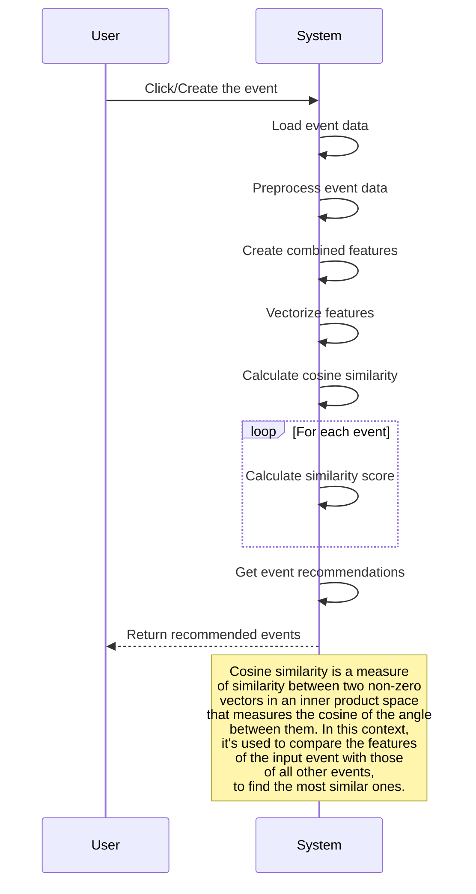

# Recommendation Engine Algorithm

The algorithm implements a content-based recommendation system for events.

**Steps:**

1. User Input: The user click or create the event they are interested in.
2. Load Event Data: The system loads a database containing information about various events.
3. Preprocess Event Data: The system preprocesses the data extracted from the database, potentially cleaning it, structuring it, or deriving specific features (e.g., keywords from event title, category etc.).
4. Create Combined Features: The system combines different features from the event data into a single representation for each event.
5. Vectorize Features: The system transforms the combined features into numerical vectors, which can be mathematically compared.
6. Calculate Cosine Similarity (Loop):
7. For each event in the database, the system calculates the cosine similarity score between its vector representation and the vector representation of the user's input event.

#### Cosine similarity measures how "aligned" two vectors are, with values closer to 1 indicating strong similarity and closer to 0 meaning less similarity.

8. Get event Recommendations: The system likely sorts the similarity scores and selects the top few events as recommendations.
9. Return Recommendations: The system displays the list of recommended events to the user.

